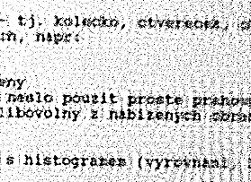
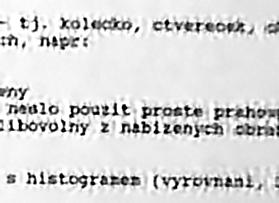

# Refocus-it

- Introduction
- Documentation
- Examples
- News
- Author

## Introduction

The Refocus-it [GIMP](http://www.gimp.org/) plug-in, released under [GNU General Public License (GPL)](COPYING), can be used to refocus images acquired by a defocused camera, blurred by gaussian or motion blur or any combination of these.

There are a few nice features of this plug-in, especially adaptive / static area smoothing used to remove the so called "ringing" effect introduced by edges in the image and effects introduced by noise. Mirror and periodical boundary conditions are available. Preview helps you select the best parameters.

There are a few NOT nice features of this plug-in as well, namely its memory and CPU requirements.

The algorithm is based on finding the minimum of the error function using Hopfield neural network.

## Documentation

No doc is available yet.

## Examples

This is a snapshot of text document acquired by a defocused camera. The blur radius is about 6.5 (determined by a try / error method).


## Simple restoration

The first restored image shows result of restoration with following parameters:

- Radius: 6.50
- Gauss: 0.00
- Motion size: 0.00
- Motion angle: 0.00
- Noise: 0.00
- Iterations: 200
- Boundary: mirror boundary



Notice the amplified noise in the restored image.

## Restoration with noise reduction

The second image was restored using these parameters:

- Radius: 6.50
- Gauss: 0.00
- Motion size: 0.00
- Motion angle: 0.00
- Noise: 1000.00
- Iterations: 200
- Boundary: mirror boundary
- Smoothness: 0.0


Notice that the amplified noise has been partialy removed.

## Restoration with area smoothing

The last snapshot shows result of restoration with parameters:

- Radius: 6.50
- Gauss: 0.00
- Motion size: 0.00
- Motion angle: 0.00
- Noise: 1000.00
- Iterations: 200
- Boundary: mirror boundary
- Smoothness: 100.0
- Area size: 3
- Adaptive smoothing: yes



Notice the benefit of adaptive area smoothing. The noise has almost disapeared from the smooth areas.

## Installation method

Installing from Git master requires 2 preparatory steps:

First, you need to create the ./configure script if you do not have it yet
```sh
autoreconf -if  (or use 'autoreconf --install --force' for some setups)
automake --foreign -Wall
```
Second, you then use the usual steps to compile the plug-in.
Various operating systems and setups will need ./configure options set.
Here are example install steps for Linux, FreeBSD, Win32/64 are shown below:

Installing on Linux
```sh
./configure --prefix=/usr
make
sudo make install
```

Installing on FreeBSD
```sh
./configure --prefix=$(pwd)/BUILD
make
make install
```

Installing on Windows 32-bit
```sh
./configure --host=i686-w64-mingw32 --prefix=$(pwd)/build-w32
make
make install
```

Installing on Windows 64-bit
```sh
./configure --host=x86_64-w64-mingw32 --prefix=$(pwd)/build-w64
make
make install
```

## News

- 2.1 (2025feb20) Imported refocus-it from sourceforge to github. Replaced intltool with gettext, upgraded build to autoconf 2.69, removed xmalloc and used standard malloc instead. Removed several extras such as inline and float options in anticipation of building for gimp3 plugin. This still builds for gimp2. If you need cmd-line tools, please revert to using version 2.0.0 which still contains original cmd-line build. Removed micro-version value - this leaves micro open for distros if they need/want it.
- 2.0.0 (2004jul20) refocus-it plugin for GIMP-2.0 released. This version is internationalized and includes a command-line version of refocus-it suitable for processing PNM files in batch mode. The command-line version is also easily portable to non-GNU platforms.
- 1.0.2 (2003jun19) First public release.

## Authors

This plug-in was written by Lukas Kunc in 2003..2004.

Note: The Original Web page content, pictures, and files were located here https://refocus-it.sourceforge.net/ for versions 1.0.2 & 2.0.0

Recent updates and patching by Joe da Silva in 2024..2025.
